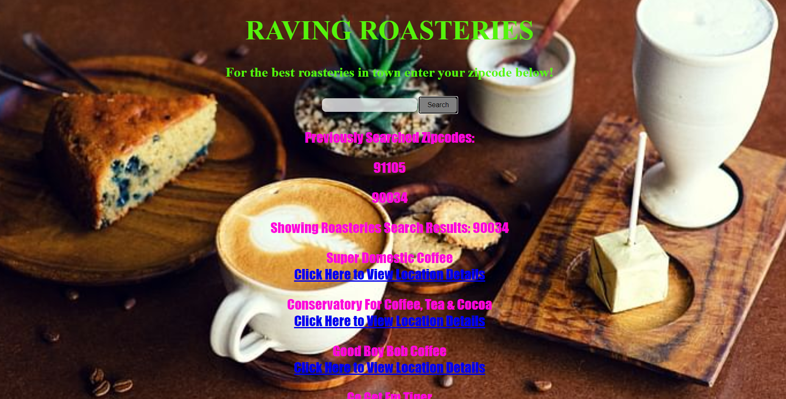

## Raving Roasteries

## Purpose
Create a real-world front-end application to be able to showcase to potential employers. This application was developed to fulfill a demand for travelers looking for local coffee roasteries. End users can use Raving Roasteries to get a list of coffee roasteries based on their zipcode. They will have the option to click on a link to view information based on their selection and store past zipcode searches. 

## Built With
* JavaScript
* HTML
* CSS
* GitHub
* Postman
* Heroku
* API Documentation

## Website
https://mmanalang21.github.io/project-1-ucla/

## Contribution
Made by Alejandro Robles & Matthew Manalang
